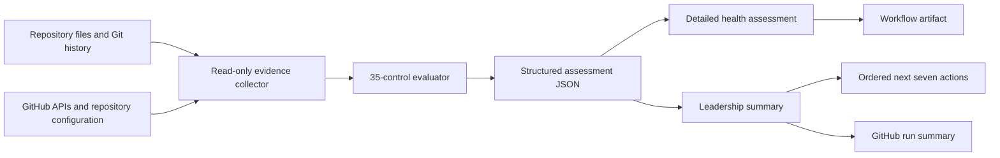

# Automated Repository Health Assessment Guide

**Standard assessed:** 0.1.0-draft

**Automation status:** Diagnostic preview

**Enforcement status:** Not a release or compliance gate

This guide explains how the repository-health automation collects evidence, applies the existing standard, and creates reports for engineers and nontechnical leaders. The automation is a supporting assessor. It does not replace the normative [Repository Health Standard](repository-health-standard.md), [Control Catalog](control-catalog.md), [Measurement Dictionary](measurement-dictionary.md), or [Scoring, Assurance, and Exceptions](scoring-assurance-exceptions.md).

The automation follows one governing rule: **absence of evidence is Unknown, not healthy**. A GitHub setting, repository file, or declared configuration is credited only to the assurance level it actually demonstrates.

## Quick start

### Run this standards repository

This repository already contains the local composite action, declaration, and scheduled workflow. After the files are committed to the default branch, enable GitHub Actions and either wait for the weekly schedule or start **Repository health assessment** from the Actions page with `workflow_dispatch`.

The scheduled workflow is [.github/workflows/repository-health.yml](../.github/workflows/repository-health.yml). It invokes the action in [.github/actions/repository-health/action.yml](../.github/actions/repository-health/action.yml) and reads [.github/repository-health.toml](../.github/repository-health.toml).

### Use a centrally maintained action

1. Publish this full repository—automation, catalog, and supporting documents—to an approved internal GitHub repository.
2. Select and review a commit, then use its full 40-character SHA as the action reference.
3. Copy [the conservative configuration](../examples/config/repository-health.toml) to `.github/repository-health.toml` in the repository to assess.
4. Copy [the consumer workflow](../examples/workflows/repository-health.yml) to `.github/workflows/repository-health.yml`.
5. Replace `YOUR-ORGANIZATION/repository-health-standard` and `REPLACE_WITH_FULL_COMMIT_SHA` in the workflow.
6. Complete only the declarations supported by current evidence, list the exact authoritative check names for Main, and start a manual run.
7. Review both Markdown reports and the structured JSON before relying on the standing or action order.

The consumer workflow intentionally pins the central action by commit. GitHub recommends treating third-party action workflows as code and supports full-length commit SHAs as the immutable reference. See [Secure use reference](https://docs.github.com/en/actions/reference/security/secure-use).

GitHub Enterprise Server requires an internally reachable copy of the action repository. `actions/upload-artifact@v4` and later are not supported on GitHub Enterprise Server, so replace that upload step with the artifact mechanism supported by the installed server version. The evaluator itself uses `GITHUB_API_URL` and can query the current server when the token has access.

### Run the evaluator locally

Python 3.11 or newer is required. From the repository root:

```bash
python3 -m automation.repository_health assess \
  --repository . \
  --catalog docs/control-catalog.md \
  --config .github/repository-health.toml \
  --output repository-health-report/repository-health-assessment.json

python3 -m automation.repository_health.reporting \
  --assessment repository-health-report/repository-health-assessment.json \
  --output-dir repository-health-report
```

Local collection does not call GitHub unless a repository identity and token are supplied. A local working tree can differ from Main; the assessment records the checkout/Main relationship and cleanliness so that uncommitted files are not silently represented as pushed evidence.

## 1. What runs



The package contains:

- A standard-library Python evaluator under `automation/repository_health/`.
- A reusable composite action under `.github/actions/repository-health/`.
- A scheduled and manually triggered workflow under `.github/workflows/`.
- A consumer workflow example under `examples/workflows/`.
- A conservative TOML configuration whose defaults create Unknown results rather than invented assurance.

No collector executes repository-owned build, test, deployment, or remediation commands. Existing CI and delivery systems remain responsible for producing those results; the collector reads the evidence they retain.

## 2. Generated reports

Each successful run produces these files:

| Artifact | Audience | Purpose |
| --- | --- | --- |
| `repository-health-assessment.json` | Tools, assessors, auditors | Complete structured facts, evidence, control dispositions, dimensions, gates, score, assurance, findings, limitations, and separate DORA data. |
| `health-assessment.md` | Engineering and repository owners | Detailed assessment with traceability from every result to evidence and limitations. |
| `leadership-summary.md` | Nontechnical leaders | Plain-language standing, what it means, and the next actions in priority order. |
| `leadership-summary.json` | Portfolio reporting | Compact machine-readable standing and ordered action list. |

The leadership summary never presents the grade by itself. It includes evidence confidence, foundational weaknesses, and up to seven distinct actions. If fewer than seven genuine gaps exist, it reports only the work that is actually needed.

### 2.1 Attested release evidence

The repository's separate [release workflow](../.github/workflows/release.yml) runs only for immutable version tags matching the documented `vMAJOR.MINOR.PATCH[-prerelease]` form. Before publishing, it verifies that the tagged commit is reachable from Main and that the exact commit has a successful `Validate repository` check.

The workflow builds a revision-bound source archive, a file-level SPDX 2.3 SBOM, a revision-and-artifact identity record, and `SHA256SUMS`. GitHub's artifact-attestation action binds the archive digest and SBOM statement to the publication-workflow identity. Normal publication runs from the tag; guarded recovery runs from Main and records that signer ref separately from the tagged artifact source. The release is created only after all five records are complete, and repository-level immutable releases then lock the published assets and tag against deletion or update.

The release path is intentionally separate from the read-only assessor. Its verification and build job has only `contents: read` and `checks: read`; it transfers checksummed evidence to a second job. Only that isolated publisher receives `contents: write`, `attestations: write`, and `id-token: write`, and it never checks out or executes repository code. The assessment action remains read-only.

After fetching an existing version tag, rebuild its records locally without publishing them:

```bash
python3 -m automation.repository_health.release \
  --repository . \
  --revision v0.1.0-draft \
  --tag v0.1.0-draft \
  --source-repository https://github.com/TedTschopp/github-repository-health \
  --output-directory release-dist
```

The workflow fixes the runner family and Python patch; the identity also records the Git and Python toolchain. Matching bytes demonstrate same-toolchain repeatability, not universal cross-toolchain reproducibility. Local generation does not prove GitHub publication or attestation. Production correspondence is established only when the protected tag, release assets, digests, source identity, and GitHub attestation all agree.

For this repository, the current unit, resolver, exact published identity, evidence digests, and supersession rules are controlled in the machine-readable [production identity record](../.github/repository-health-production.json) and explained in the [release and production correspondence record](release-and-production.md). Those records declare the resolver; they do not replace live verification of the release, tag, checksums, Main reachability, intervening Main validation, or attestations.

Normal publication is tag-triggered. A guarded `workflow_dispatch` input accepts an existing protected version tag only for recovery from an interrupted or failed tag run. It rebuilds that tag's exact revision and applies the same Main-reachability, authoritative-check, tag/version/SHA, checksum, attestation, and existing-release safeguards; it cannot move the tag or replace a published release.

## 3. Evidence boundaries

### 3.1 Evidence the action can collect directly

Depending on token access and repository configuration, the action can observe:

- the Main-role ref and exact revision;
- Git history, branch and tag inventory, activity, and contributor count;
- repository files such as README, ownership, support, security, contribution, license, changelog, dependency, lock, and workflow files;
- GitHub repository and default-branch metadata;
- workflow definitions, exact-revision check results, recent pull requests, releases, tags, and visible branch/ruleset protection state; and
- explicit, evidence-backed repository profile and control inputs from the TOML file.

These observations do not automatically prove production state, effective bypass behavior, release provenance, vulnerability disposition, operational recovery, or portfolio uniqueness.

### 3.2 Evidence that normally requires another system

The following commonly remain Unknown until supplied from their system of record:

- current production or published identity for every deployable unit;
- artifact digests and source-to-artifact-to-deployment lineage;
- effective permissions, inherited rules, bypass use, and audit-log completeness;
- dependency and vulnerability findings with disposition and due dates;
- rollback, restore, withdrawal, or supersession exercises;
- incident, support, and operational-readiness evidence;
- authoritative portfolio and duplicate-repository records; and
- reliable application- or service-level DORA outcomes.

Use a control override only when the referenced evidence meets the catalog requirement. A written assertion normally establishes E1; current configuration can establish E2; demonstrated operation requires E3; and sustained effectiveness requires E4.

### 3.3 Inaccessible GitHub evidence

The workflow's normal `GITHUB_TOKEN` is intentionally read-only and repository-scoped. Some detailed protection and administration endpoints require permissions that the standard workflow token does not provide. A `403` or `404` is recorded as an evidence gap, never interpreted as an absent or passing control.

Organizations that require deeper configuration evidence should use a narrowly scoped GitHub App or fine-grained token under their credential policy. Supplying a more privileged token expands visibility; it does not grant the action permission to change repository state.

## 4. Repository configuration

The default location is `.github/repository-health.toml`. The evaluator requires Python 3.11 or newer because it uses the standard-library TOML parser.

```toml
[standard]
version = "0.1.0-draft"

[repository]
type = "Deployable application"
lifecycle = "Active"
risk_tier = "Elevated"
main_branch = "main"
owner = "Payments Engineering"
methodology = "GitHub Flow/short-lived feature branches"
observed_methodology = "GitHub Flow/short-lived feature branches"
methodology_confidence = "Moderate"
methodology_evidence_ids = ["ARCH-WORKFLOW-2026-03"]
methodology_contradictions = []
authoritative_checks = ["build-and-test", "release-readiness"]
deployable_units = ["payments-api"]
production_correspondence = "Releasable-Main"

# Each applicability flag accepts true, false, auto, or unknown.
has_current_output = true
publishes_artifacts = true
has_dependencies = "auto"
has_automation = "auto"
has_proposed_change_validation = "auto"
multi_contributor = "auto"
supported = true
has_critical_paths = true
has_produced_artifacts = true
automated_deployment = true
operated_service = true
portfolio_managed = true
has_work_refs = "auto"

[assessment]
observation_days = 90
low_activity_days = 365
assessor = "repository-health automation"
reviewer = "Payments architecture reviewer"
next_review = "2026-11-09"

[methodology_axes]
canonical_integration_topology = "One shared Main role"
change_ingress = "Short-lived branch pull requests"
branch_purpose_and_lifetime = "Change branches removed after integration"
integration_cadence = "Continuous"
release_source = "Immutable revisions reachable from Main"
promotion_mechanism = "Artifact promotion"
parallel_support = "No supported parallel release line"
control_placement = "GitHub rules and required checks"
repository_topology = "Shared canonical repository"

[dora]
available = false
reason = "Product-level deployment data is maintained outside GitHub."
```

`auto` permits a conservative inference from observable repository facts. `unknown` states that the assessment cannot determine the fact. A declared `false` value affects applicability analysis but does not, by itself, constitute an approved N/A determination.

### 4.1 Evidence-backed control input

Use a control table when reliable evidence is available outside the collector:

```toml
[controls."RRO-02"]
conformance = "Met"
assurance = "E3"
rationale = "The recovery exercise completed successfully for every current production unit."
evidence_ids = ["OPS-RECOVERY-2026-07"]
```

The evaluator rejects an override without a rationale and evidence reference. The input does not override the catalog's minimum assurance. A temporary risk waiver remains visible and does not turn an Unmet or Unknown control into Met.

An N/A disposition also requires an approver:

```toml
[controls."SPI-02"]
conformance = "N/A"
assurance = "E2"
rationale = "The repository has no deployed, published, distributed, applied, or supported output."
evidence_ids = ["PORTFOLIO-NO-OUTPUT-2026-08"]
n_a_approved_by = "Enterprise Architecture"
n_a_approved_at = "2026-08-09"
n_a_review_date = "2026-11-07"
```

The assessor remains responsible for confirming that the catalog actually permits N/A for the stated scope.

### 4.2 Optional DORA outcome input

DORA inputs are accepted only as a complete, separately evidenced service-level panel. They never affect repository scoring.

```toml
[dora]
available = true
service = "payments-api"
period_start = "2026-05-01"
period_end = "2026-07-31"
evidence_ids = ["DELIVERY-METRICS-2026-Q2"]
context = "Customer-facing API; planned weekday releases."
limitations = "Emergency manual releases are reconciled the next business day."

[dora.metrics.change_lead_time]
value = "18 hours median; 44 hours p85"
unit = "hours"
source = "delivery analytics export"
formula = "production deployment time minus first commit time; median and p85"
coverage = "100 percent of 36 production changes"
limitations = "Batch releases can include more than one change."

[dora.metrics.deployment_frequency]
value = "12 per month"
unit = "production deployments per month"
source = "deployment system"
formula = "successful production deployments divided by months observed"
coverage = "100 percent of production deployment records"
limitations = "Reports the service as a whole, not this repository alone."

[dora.metrics.failed_deployment_recovery_time]
value = "41 minutes median"
unit = "minutes"
source = "deployment and incident systems"
formula = "recovery time minus failed-deployment start time; median"
coverage = "100 percent of four failed deployments"
limitations = "Small sample; interpret as Low Sample."

[dora.metrics.change_fail_rate]
value = "8 percent"
unit = "percent"
source = "deployment and incident systems"
formula = "deployments requiring immediate intervention divided by production deployments"
coverage = "100 percent of production deployment records"
limitations = "Uses the service's approved intervention classification."

[dora.metrics.deployment_rework_rate]
value = "6 percent"
unit = "percent"
source = "delivery work records"
formula = "deployment effort correcting earlier deployments divided by total deployment effort"
coverage = "96 percent of classified deployment effort"
limitations = "Four percent of effort was not classifiable and was not imputed."
```

When `available = false`, supply a plain-language `reason`. Do not estimate missing deployment outcomes from pull requests, commits, or repository activity.

## 5. Scoring and action ordering

The evaluator uses the unchanged 0.1.0-draft rules:

- Met = 1, Partially met = 0.5, and Unmet or Unknown = 0.
- Each applicable control is equally weighted within its dimension.
- Each applicable dimension is equally weighted in the overall score.
- A failed or Unknown applicable foundational gate caps the effective result at 69.0/D/M1.
- N/A is excluded only with documented rationale and approval.
- DORA outcomes remain informative and never change the repository-health score.

The leadership action list uses the finding priority from the manual assessment guide:

1. failed or Unknown foundational gates;
2. Critical-tier failures and expired decisions;
3. known high-risk control failures;
4. repeated build, release, security, or operational weakness;
5. evidence gaps preventing a reliable decision; and
6. remaining maintainability and usability improvements.

Within a priority class, the renderer favors the action that removes the broadest risk or unlocks the next decision. It de-duplicates closely related controls so leadership receives seven decisions or investments, not seven variations of the same task.

## 6. GitHub Actions operating model

The provided workflow runs weekly at a minute offset from the top of the hour and can also be started manually. It:

1. checks out full Git history without retaining write credentials;
2. selects a supported Python runtime;
3. runs the read-only composite action;
4. appends the leadership brief to the GitHub run summary; and
5. uploads all four reports as a retained workflow artifact.

The action fails only when configuration, catalog parsing, collection, evaluation, or report generation cannot complete. It does **not** fail because a repository has a low score or a foundational weakness. Provisional 0.1.0-draft results must not be used as a release or compliance gate.

Scheduled workflows run from the default branch and may be delayed during periods of GitHub Actions load. Use the manual trigger for an immediate reassessment after material remediation.

GitHub documents that scheduled workflows run on the default branch and can be delayed during high-load periods, especially near the start of the hour. See [Events that trigger workflows](https://docs.github.com/en/actions/reference/workflows-and-actions/events-that-trigger-workflows#schedule).

### 6.1 Composite-action inputs

| Input | Default | Purpose |
| --- | --- | --- |
| `repository-path` | `.` | Checked-out repository to assess. |
| `config-path` | `.github/repository-health.toml` | Repository declaration and evidence references. |
| `output-directory` | `repository-health-report` | Destination for the four stable reports. |
| `github-repository` | Current `${{ github.repository }}` | Optional `owner/name` override. |
| `github-token` | Empty | Read-only token for visible GitHub evidence. The example passes `${{ github.token }}`. |

The action exposes report paths plus raw/effective score, grade, maturity, active-cap state, and assurance as outputs. It appends only the leadership Markdown to `GITHUB_STEP_SUMMARY`; artifact upload and retention remain explicit workflow-owner decisions. GitHub job summaries are backed by the per-step `GITHUB_STEP_SUMMARY` file; see [Adding a job summary](https://docs.github.com/en/actions/writing-workflows/choosing-what-your-workflow-does/workflow-commands-for-github-actions#adding-a-job-summary).

### 6.2 Token permissions and inaccessible settings

The example workflow grants `actions: read`, `checks: read`, `contents: read`, and `pull-requests: read`. The automatic `GITHUB_TOKEN` is repository-scoped and expires when the job ends. See [Automatic token authentication](https://docs.github.com/en/actions/security-for-github-actions/security-guides/automatic-token-authentication).

GitHub's detailed branch-protection endpoint requires administration read permission. The normal workflow does not elevate itself to obtain that access; an inaccessible response remains Unknown. See [Branch protection REST API](https://docs.github.com/en/rest/branches/branch-protection#get-branch-protection).

## 7. Security and privacy

- Keep workflow permissions read-only and grant only the evidence scopes in use.
- Prefer a GitHub App or fine-grained token over a broadly scoped personal token when additional evidence access is required.
- Pin external actions to reviewed immutable revisions.
- Do not place secrets, confidential logs, regulated data, or raw vulnerability details in configuration, workflow summaries, or artifacts.
- Store evidence references and immutable identifiers rather than sensitive evidence copies.
- Treat repository files and API responses as untrusted input when rendering Markdown; the reporter escapes or normalizes unsafe content.
- Set artifact retention to the minimum period required by the assessment and records policy.

## 8. Interpretation and limitations

An automated result can be useful before it is complete. A low score dominated by Unknown controls usually means leadership should first fund evidence access and ownership, not assume that every underlying practice is failing. Conversely, a configured setting at E2 does not prove sustained effectiveness.

The report must retain this disclosure:

> This automated assessment uses the provisional Git Repository Health Standard 0.1.0-draft. It is an improvement diagnostic, not a compliance certification or release gate. Automated collection is limited to the evidence sources and permissions listed in the report; Unknown does not mean failed, and configured does not mean demonstrated effective.

The real 12-repository, two-assessor calibration pilot remains required before the standard or automated evaluator can be described as enterprise-calibrated.
